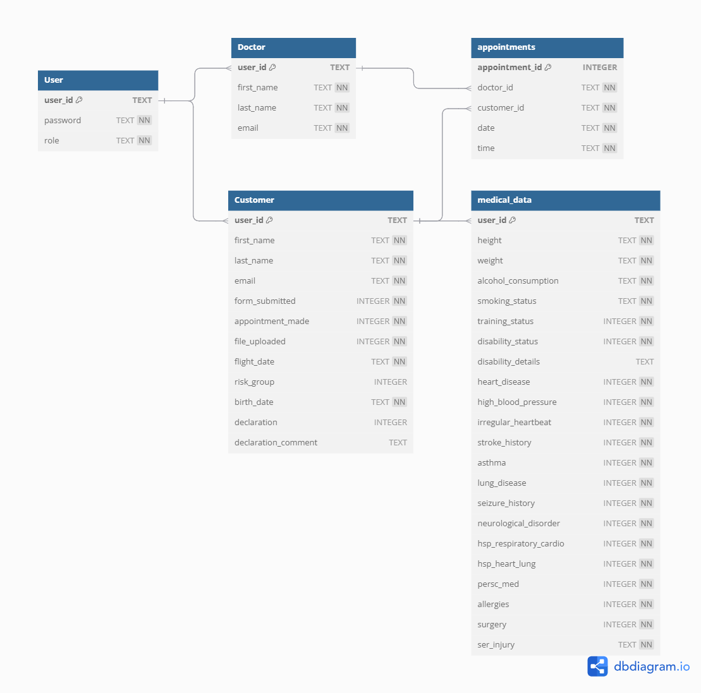

# Datenmodell

Das Datenmodell der Anwendung "FlightPrep" ist in einer SQLite-Datenbank namens `FlightPreperation.db` implementiert. Dieses Dokument beschreibt die Struktur der Datenbank, einschließlich des Entity-Relationship-Diagramms und detaillierter Tabellenbeschreibungen.

## Entity-Relationship-Diagramm (ERD)

Das folgende Diagramm visualisiert die Entitäten und ihre Beziehungen innerhalb der Datenbank `FlightPreperation.db`. 

## Tabellendetails (aus DBML)

Die Struktur der Datenbanktabellen, wie in `datenbank-schema.dbml` definiert:

### Tabelle: User

*   `user_id` (TEXT, PRIMARY KEY, UNIQUE): Eindeutiger Identifikator des Benutzers.
*   `password` (TEXT, NOT NULL): Das Passwort des Benutzers.
*   `role` (TEXT, NOT NULL): Die Rolle des Benutzers im System (z.B. "Customer" oder "Doctor"), die seine Berechtigungen steuert.

### Tabelle: Customer

*   `user_id` (TEXT, PRIMARY KEY, FOREIGN KEY references `User.user_id`): Fremdschlüssel, der auf die `User`-Tabelle verweist und den Kunden eindeutig identifiziert.
*   `first_name` (TEXT, NOT NULL): Vorname des Kunden.
*   `last_name` (TEXT, NOT NULL): Nachname des Kunden.
*   `email` (TEXT, NOT NULL): E-Mail-Adresse des Kunden.
*   `form_submitted` (INTEGER, NOT NULL, DEFAULT: 0): Status, ob der medizinische Fragebogen vom Kunden ausgefüllt und eingereicht wurde (0 = nein, 1 = ja).
*   `appointment_made` (INTEGER, NOT NULL, DEFAULT: 0): Status, ob ein Arzttermin vereinbart wurde (0 = nein, 1 = ja).
*   `file_uploaded` (INTEGER, NOT NULL, DEFAULT: 0): Status, ob die vom Arzt angeforderten Dokumente/Bescheinigungen hochgeladen wurden (0 = nein, 1 = ja).
*   `flight_date` (TEXT, NOT NULL): Geplantes Flugdatum des Kunden.
*   `risk_group` (INTEGER): Vom System oder Arzt zugewiesene Risikogruppe des Kunden.
*   `birth_date` (TEXT, NOT NULL): Geburtsdatum des Kunden.
*   `declaration` (INTEGER): Status der Flugtauglichkeitserklärung durch den Arzt (0 = nicht tauglich/ausstehend, 1 = tauglich).
*   `declaration_comment` (TEXT): Optionaler Kommentar des Arztes zur Flugtauglichkeitserklärung.
*   *Hinweis: UNIQUE(user_id, birth_date)*

### Tabelle: Doctor

*   `user_id` (TEXT, PRIMARY KEY, FOREIGN KEY references `User.user_id`): Fremdschlüssel, der auf die `User`-Tabelle verweist und den Arzt eindeutig identifiziert.
*   `first_name` (TEXT, NOT NULL): Vorname des Arztes.
*   `last_name` (TEXT, NOT NULL): Nachname des Arztes.
*   `email` (TEXT, NOT NULL): E-Mail-Adresse des Arztes.

### Tabelle: appointments

*   `appointment_id` (INTEGER, PRIMARY KEY, AUTOINCREMENT): Eindeutiger, automatisch generierter Primärschlüssel für den Termin.
*   `doctor_id` (TEXT, NOT NULL, FOREIGN KEY references `Doctor.user_id`): Fremdschlüssel, der auf den Arzt (`Doctor.user_id`) verweist, bei dem der Termin stattfindet.
*   `customer_id` (TEXT, NOT NULL, FOREIGN KEY references `Customer.user_id`): Fremdschlüssel, der auf den Kunden (`Customer.user_id`) verweist, der den Termin hat.
*   `date` (TEXT, NOT NULL): Datum des Termins.
*   `time` (TEXT, NOT NULL): Uhrzeit des Termins.
*   *Hinweis: UNIQUE(date, time)*

### Tabelle: medical_data

*   `user_id` (TEXT, PRIMARY KEY, FOREIGN KEY references `Customer.user_id`): Fremdschlüssel, der auf den Kunden (`Customer.user_id`) verweist, zu dem diese medizinischen Daten gehören.
*   `height` (TEXT, NOT NULL): Körpergröße des Kunden.
*   `weight` (TEXT, NOT NULL): Körpergewicht des Kunden.
*   `alcohol_consumption` (TEXT, NOT NULL): Angaben zum Alkoholkonsum des Kunden (Nein, Gelegentlich, Regelmäßig, Häufig)
*   `smoking_status` (TEXT, NOT NULL): Angaben zum Rauchstatus des Kunden. (Ja, Nein, gelegentlich)
*   `training_status` (INTEGER, NOT NULL): Angabe, ob der Kunde bereits an Trainingsprogrammen teilgenommen hat, die mit der Vorbereitung von Astronauten vergleichbar sind (0 = nein, 1 = ja).
*   `disability_status` (INTEGER, NOT NULL): Status, ob eine Behinderung vorliegt (0 = nein, 1 = ja).
*   `disability_details` (TEXT): Details zur Behinderung, falls vorhanden.
*   `heart_disease` (INTEGER, NOT NULL): Angabe, ob eine Herzerkrankung vorliegt (0 = nein, 1 = ja).
*   `high_blood_pressure` (INTEGER, NOT NULL): Angabe, ob Bluthochdruck vorliegt (0 = nein, 1 = ja).
*   `irregular_heartbeat` (INTEGER, NOT NULL): Angabe, ob ein unregelmäßiger Herzschlag vorliegt (0 = nein, 1 = ja).
*   `stroke_history` (INTEGER, NOT NULL): Angabe, ob in der Vergangenheit ein Schlaganfall aufgetreten ist (0 = nein, 1 = ja).
*   `asthma` (INTEGER, NOT NULL): Angabe, ob Asthma vorliegt (0 = nein, 1 = ja).
*   `lung_disease` (INTEGER, NOT NULL): Angabe, ob eine andere Lungenerkrankung vorliegt (0 = nein, 1 = ja).
*   `seizure_history` (INTEGER, NOT NULL): Angabe, ob in der Vergangenheit Krampfanfälle aufgetreten sind (0 = nein, 1 = ja).
*   `neurological_disorder` (INTEGER, NOT NULL): Angabe, ob eine neurologische Störung vorliegt (0 = nein, 1 = ja).
*   `hsp_respiratory_cardio` (INTEGER, NOT NULL): Angabe, ob Krankenhausaufenthalte aufgrund von Atemwegs- oder Herz-Kreislauf-Erkrankungen vorlagen (0 = nein, 1 = ja).
*   `hsp_heart_lung` (INTEGER, NOT NULL): Angabe, ob Krankenhausaufenthalte aufgrund von Herz- oder Lungenerkrankungen vorlagen (0 = nein, 1 = ja).
*   `persc_med` (INTEGER, NOT NULL): Angabe, ob verschreibungspflichtige Medikamente eingenommen werden (0 = nein, 1 = ja).
*   `allergies` (INTEGER, NOT NULL): Angabe, ob Allergien vorliegen (0 = nein, 1 = ja).
*   `surgery` (INTEGER, NOT NULL): Angabe, ob Operationen durchgeführt wurden (0 = nein, 1 = ja).
*   `ser_injury` (TEXT, NOT NULL): Beschreibung schwerwiegender Verletzungen.
*   `risk_group` (INTEGER): Risikoeinstufung des Kunden durch die interne KI (1 = niedriges Risiko, 2 = mittleres Risiko, 3 = hohes Risiko).