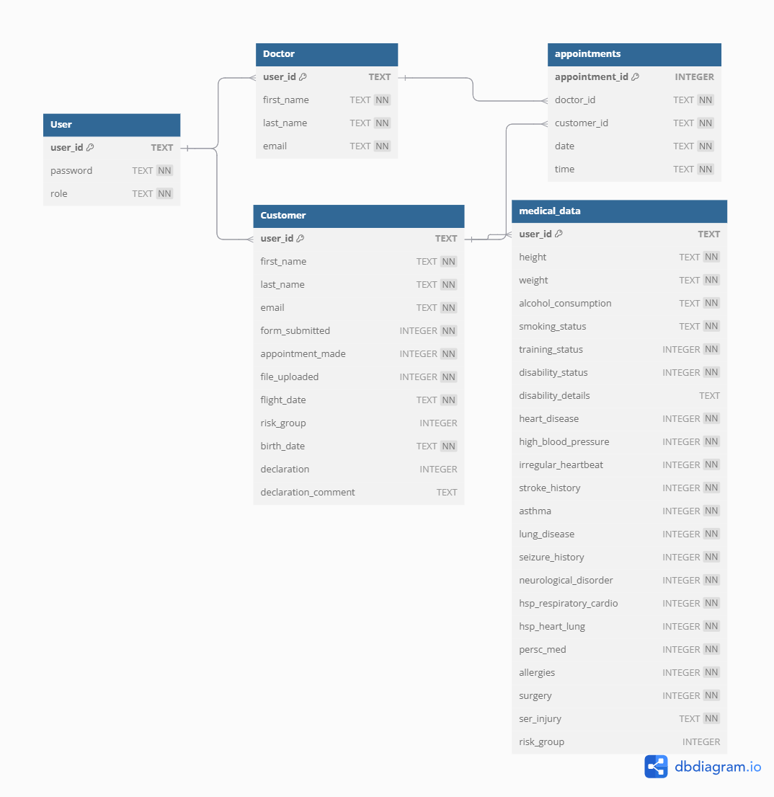

# Technische Dokumentation

## Inhaltsverzeichnis

1.  [Einleitung und Ziele des Projekts](#1-einleitung-und-ziele-des-projekts)
2.  [Vorbedingungen](#2-vorbedingungen)
    *   [2.1 Technische Voraussetzungen](#21-technische-voraussetzungen)
    *   [2.2 Daten-Voraussetzungen für Kunden](#22-daten-voraussetzungen-für-kunden)
    *   [2.3 Daten-Voraussetzungen für Ärzte](#23-daten-voraussetzungen-für-ärzte)
3.  [Architekturüberblick](#3-architekturüberblick)
4.  [Paketstruktur](#4-paketstruktur)
    *   [com.example.flightprep.controller](#41-comexampleflightprepcontroller)
        *   [com.example.flightprep.controller.BasicController](#411-comexampleflightprepcontrollerbasiccontroller)
        *   [com.example.flightprep.controller.Customer](#412-comexampleflightprepcontrollercustomer)
        *   [com.example.flightprep.controller.Doctor](#413-comexampleflightprepcontrollerdoctor)
        *   [com.example.flightprep.controller.Login](#414-comexampleflightprepcontrollerlogin)
    *   [com.example.flightprep.dao](#42-comexampleflightprepdao)
    *   [com.example.flightprep.service](#43-comexampleflightprepservice)
    *   [com.example.flightprep.util](#44-comexampleflightpreputil)
    *   [com.example.flightprep.database](#45-comexampleflightprepdatabase)
5.  [Datenmodell (Detaillierter)](#5-datenmodell-detaillierter)
    *   [Entity-Relationship-Diagramm (ERD)](#51-entity-relationship-diagramm-erd)
    *   [Tabellendetails (aus DBML)](#52-tabellendetails-aus-dbml)
        *   [Tabelle: User](#521-tabelle-user)
        *   [Tabelle: Customer](#522-tabelle-customer)
        *   [Tabelle: Doctor](#523-tabelle-doctor)
        *   [Tabelle: appointments](#524-tabelle-appointments)
        *   [Tabelle: medical_data](#525-tabelle-medical_data)
6.  [User Interface (UI) und User Experience (UX) Fluss](#6-user-interface-ui-und-user-experience-ux-fluss)
    *   [6.1 FXML-Dateien und zugehörige Controller](#61-fxml-dateien-und-zugehörige-controller)
        *   [6.1.1 Login-Ansicht](#611-login-ansicht)
        *   [6.1.2 Kunden-Ansichten (`CustomerScreens`)](#612-kunden-ansichten-customerscreens)
        *   [6.1.3 Arzt-Ansichten (`DocScreens`)](#613-arzt-ansichten-docscreens)
7.  [Abhängigkeiten und externe Bibliotheken](#7-abhängigkeiten-und-externe-bibliotheken)
8.  [Build- und Deployment-Prozess](#8-build--und-deployment-prozess)
9.  [Fehlerbehandlung und Logging](#9-fehlerbehandlung-und-logging)
10. [Sicherheitsaspekte](#10-sicherheitsaspekte)
11. [Konfiguration](#11-konfiguration)
12. [Teststrategie](#12-teststrategie)
13. [Glossar](#13-glossar)

## 1. Einleitung und Ziele des Projekts

Die Anwendung "FlightPrep" dient der Verwaltung und Vorbereitung von Passagieren für Weltraumflüge. Dieser Prototyp fokussiert sich auf die Digitalisierung und Vereinfachung des medizinischen Überprüfungsprozesses sowohl für Kunden (Passagiere) als auch für das medizinische Personal (Ärzte).

**Hauptziele:**

*   Erfassung medizinischer Basisdaten der Kunden mittels Fragebögen.
*   Verwaltung von Arztterminen für die Flugtauglichkeitsprüfung.
*   Hochladen und Verwalten relevanter Dokumente.
*   Unterstützung der Ärzte bei der Bewertung der Flugtauglichkeit von Kunden.
*   Feststellung und Dokumentation der Flugtauglichkeit von Kunden für weiterführende Prozesse.

**Zielgruppe:**

*   **Kunden (Passagiere):** Personen, die einen Weltraumflug gebucht haben und die notwendigen medizinischen Vorbereitungen treffen müssen.
*   **Ärzte:** Medizinisches Fachpersonal, das für die Überprüfung der medizinischen Daten und die Erteilung der Flugtauglichkeit zuständig ist.

**Prozessauslöser und -abschluss im Kontext des Prototyps:**

Der **Startpunkt** für den in "FlightPrep" abgebildeten Vorbereitungsprozess ist die Bereitstellung initialer Kundendaten in der Datenbank, typischerweise durch einen vorgelagerten Buchungsprozess. Diese Daten ermöglichen es dem Kunden, sich anzumelden und die medizinische Erfassung zu beginnen.

Das **primäre Ziel und somit das Ende des Prozesses innerhalb dieses Prototyps** ist die Feststellung der Flugtauglichkeit durch den Arzt. Dies wird dokumentiert, indem der Arzt in der `Customer`-Tabelle die Spalte `declaration` mit einem entsprechenden Wert (0 für "nicht tauglich" oder 1 für "tauglich") versieht. Dieser Datenbankeintrag dient als **Trigger und Datenbasis für potenziell nachfolgende Prozesse** (z.B. die finale Flugfreigabe, operative Flugplanung etc.), die nicht Teil dieses Prototyps sind.

## 2. Vorbedingungen

Für die erfolgreiche Nutzung und Entwicklung der "FlightPrep"-Anwendung müssen folgende Vorbedingungen erfüllt sein:

### 2.1 Technische Voraussetzungen

*   **Java Development Kit (JDK):** Eine installierte Java-Version, z.B. JDK 17 oder höher.
*   **Maven:** Apache Maven muss konfiguriert sein, um das Projekt zu bauen und Abhängigkeiten zu verwalten.
*   **Betriebssystem:** Standard-Betriebssysteme (Windows, macOS, Linux), die JavaFX unterstützen.
*   **IDE (Empfohlen):** Eine integrierte Entwicklungsumgebung wie IntelliJ IDEA oder Eclipse, konfiguriert für Java und Maven.

### 2.2 Daten-Voraussetzungen für Kunden

Da die "FlightPrep"-Anwendung auf einen vorgelagerten Buchungsprozess aufbaut, müssen für jeden Kunden, der den Vorbereitungsprozess durchlaufen soll, bestimmte Basisdaten in der Datenbank vorhanden sein:

1.  **Benutzerkonto in `User`-Tabelle:**
    *   Ein Eintrag in der `User`-Tabelle ist erforderlich.
    *   Dieser Eintrag muss eine eindeutige `user_id` (Benutzerkennung) enthalten.
    *   Das Feld `password` muss gesetzt sein.
    *   Das Feld `role` muss den Wert "Customer" haben.

2.  **Kundendetails in `Customer`-Tabelle:**
    *   Ein korrespondierender Eintrag in der `Customer`-Tabelle, verknüpft über die `user_id`, ist notwendig.
    *   Folgende Felder müssen in diesem Eintrag ausgefüllt sein (entsprechend den `NOT NULL`-Anforderungen der Datenbank):
        *   `user_id` (muss mit dem Eintrag in der `User`-Tabelle übereinstimmen)
        *   `first_name` (Vorname des Kunden)
        *   `last_name` (Nachname des Kunden)
        *   `email` (E-Mail-Adresse des Kunden)
        *   `flight_date` (Geplantes Flugdatum des Kunden)
        *   `birth_date` (Geburtsdatum des Kunden)

Diese Daten werden typischerweise durch ein externes System (z.B. die Buchungsplattform) vor der Nutzung von "FlightPrep" bereitgestellt. Ohne diese initialen Daten kann sich ein Kunde nicht anmelden oder den medizinischen Vorbereitungsprozess starten.

### 2.3 Daten-Voraussetzungen für Ärzte

Ähnlich wie bei den Kunden, müssen auch für Ärzte bestimmte Daten initial in der Datenbank vorhanden sein, damit diese sich anmelden und ihre Aufgaben in der Anwendung wahrnehmen können.

1.  **Benutzerkonto in `User`-Tabelle:**
    *   Ein Eintrag in der `User`-Tabelle ist für den Arzt erforderlich.
    *   Dieser Eintrag muss eine eindeutige `user_id` (Benutzerkennung) enthalten.
    *   Das Feld `password` muss gesetzt sein.
    *   Das Feld `role` muss den Wert "Doctor" haben.

2.  **Arztdetails in `Doctor`-Tabelle:**
    *   Ein korrespondierender Eintrag in der `Doctor`-Tabelle, verknüpft über die `user_id`, ist notwendig.
    *   Folgende Felder müssen in diesem Eintrag ausgefüllt sein (entsprechend den `NOT NULL`-Anforderungen der Datenbank):
        *   `user_id` (muss mit dem Eintrag in der `User`-Tabelle übereinstimmen)
        *   `first_name` (Vorname des Arztes)
        *   `last_name` (Nachname des Arztes)
        *   `email` (E-Mail-Adresse des Arztes)

**Wichtiger Hinweis zur aktuellen Implementierung:**
Die Anwendung ist derzeit für die Nutzung durch einen Arzt ausgelegt. Für Test- und Demonstrationszwecke ist folgender Arzt fest im System hinterlegt (oder muss initial so angelegt werden):
*   **Benutzer-ID (`user_id`):** `Juergen1`
*   **Passwort:** `123`

Ohne diese spezifischen oder entsprechend angelegten Arzt-Daten kann die Funktionalität für die Arztrolle nicht genutzt werden.

## 3. Architekturüberblick

Die Anwendung "FlightPrep" basiert auf einer etablierten Schichtenarchitektur, die an das **Model-View-Controller (MVC)**-Muster angelehnt ist. Diese Architektur wird durch eine explizite **Service-Schicht** zur Kapselung der Geschäftslogik und eine **Data Access Object (DAO)-Schicht** für den standardisierten Datenbankzugriff erweitert. Eine solche Schichtentrennung fördert die Modularität, Wartbarkeit und Testbarkeit der Anwendung.

Die Hauptkomponenten dieser Architektur sind:

*   **View (Benutzeroberfläche):**
    *   **Verantwortlichkeit:** Präsentation der Daten für den Benutzer und Entgegennahme von Benutzereingaben. In "FlightPrep" wird dies durch JavaFX und FXML-Dateien realisiert, welche die Struktur und das Layout der einzelnen Ansichten definieren.
    *   **Interaktion:** Die View interagiert direkt mit dem Controller, um Benutzeraktionen zu melden und Aktualisierungen der dargestellten Daten zu empfangen.

*   **Controller (`com.example.flightprep.controller`):
    *   **Verantwortlichkeit:** Dient als Vermittler zwischen der View und der Anwendungslogik (Service-Schicht). Empfängt Eingaben von der View, validiert diese gegebenenfalls und initiiert entsprechende Aktionen in der Service-Schicht. Nach Verarbeitung durch die Service-Schicht ist der Controller dafür zuständig, die View mit den neuen Daten oder Ergebnissen zu aktualisieren.
    *   **Interaktion:** Nimmt UI-Events entgegen, delegiert die Verarbeitung an die Service-Schicht und aktualisiert die View.

*   **Service (`com.example.flightprep.service`):
    *   **Verantwortlichkeit:** Beinhaltet die Kernlogik und die Geschäftsregeln der Anwendung. Koordiniert Datenflüsse, führt Berechnungen und Validierungen durch, die über einfache Datenmanipulation hinausgehen. Nutzt die DAO-Schicht, um auf die Datenbank zuzugreifen.
    *   **Interaktion:** Wird von den Controllern aufgerufen, um Geschäftsoperationen auszuführen. Orchestriert einen oder mehrere DAO-Aufrufe, um die benötigten Daten zu lesen oder zu schreiben.

*   **Model (`com.example.flightprep.model`):
    *   **Verantwortlichkeit:** Repräsentiert die Datenstrukturen und Entitäten der Anwendung (z.B. `User`, `Customer`, `MedicalData`). Diese Objekte werden zwischen den Schichten transportiert, insbesondere zwischen DAO, Service und Controller, um Daten zu halten und zu übergeben.
    *   **Interaktion:** Dient als Datenträger zwischen den Schichten.

*   **DAO (Data Access Object) (`com.example.flightprep.dao`):
    *   **Verantwortlichkeit:** Abstrahiert und kapselt den direkten Zugriff auf die Datenbank. Jedes DAO ist typischerweise für die Persistenzoperationen (Erstellen, Lesen, Aktualisieren, Löschen - CRUD) einer bestimmten Entität zuständig. Es verbirgt die Details der SQL-Abfragen und des Datenbankverbindungshandlings vor den höheren Schichten (insbesondere der Service-Schicht).
    *   **Interaktion:** Wird von der Service-Schicht genutzt, um Datenbankoperationen durchzuführen.

*   **Datenbank (`FlightPreperation.db`):
    *   **Verantwortlichkeit:** Die persistente Speicherung der Anwendungsdaten. In diesem Projekt wird eine lokale SQLite-Datenbank verwendet.
    *   **Interaktion:** Ausschließlich über die DAO-Schicht angesprochen.

**Typischer Ablauf einer Benutzeraktion:**

Ein typischer Ablauf beginnt in der **View**, wenn ein Benutzer eine Aktion auslöst (z.B. Klick auf einen Button). Diese Aktion wird an den zuständigen **Controller** weitergeleitet. Der Controller validiert die Eingabe und ruft eine Methode in der **Service-Schicht** auf. Der Service implementiert die dazugehörige Geschäftslogik und verwendet dafür ein oder mehrere **DAOs**, um auf die **Datenbank** zuzugreifen (Daten lesen oder schreiben). Die Ergebnisse werden dann von der DAO-Schicht an die Service-Schicht und von dort zurück an den Controller gegeben, welcher schließlich die View aktualisiert, um dem Benutzer das Ergebnis der Aktion anzuzeigen. Dieser klare Daten- und Kontrollfluss trägt zur strukturierten und wartbaren Natur der Anwendung bei.

## 4. Paketstruktur

### 4.1 com.example.flightprep.controller

Dieses Paket enthält die Controller-Klassen der Anwendung, welche die Benutzerinteraktionen aus den FXML-Views verarbeiten und als Bindeglied zur Service-Schicht fungieren. Die Unterteilung in Sub-Pakete (`Customer`, `Doctor`, `Login`, `BasicController`) dient der Strukturierung nach Benutzerrollen und grundlegenden Controller-Funktionen, was die Übersichtlichkeit und Wartbarkeit fördert.

#### 4.1.1 com.example.flightprep.controller.BasicController

Dieses Paket bündelt abstrakte Basis-Controller-Klassen, die gemeinsame Funktionalitäten (z.B. für Alerts und rollenspezifische Navigation) bereitstellen. Dies dient der Code-Wiederverwendung und Konsistenz über verschiedene spezifische Controller hinweg.

*   **`GeneralController.java`**: Eine abstrakte Klasse, die grundlegende Methoden zur Anzeige von Erfolgs-, Fehler- und Informationsmeldungen (Alerts) bereitstellt. Dies zentralisiert die Logik für Benutzerfeedback, verbessert die Wartbarkeit und sichert ein konsistentes User Experience.
*   **`CustomerController.java`**: Erweitert `GeneralController` und implementiert rollenspezifische Navigationsmethoden für Kundenansichten (z.B. Wechsel zur Home-, Vorbereitungs-, Kalender- oder "Mein Flug"-Ansicht). Dies kapselt die kundenbezogene Navigation und fördert Wiederverwendung sowie Lesbarkeit.
*   **`DocController.java`**: Erweitert `GeneralController` und implementiert rollenspezifische Navigationsmethoden für Arztansichten (z.B. Wechsel zur Home-, Kalender- oder Patienten-Ansicht), analog zum `CustomerController` für die Arztrolle.
*   **`PatientDataDisplayController.java`**: Erweitert `DocController` und ist verantwortlich für die Anzeige von medizinischen Patientendaten. Diese Klasse kapselt die UI-Logik zur Darstellung von Patientendaten, was Wiederverwendung ermöglicht, falls diese Daten in verschiedenen Arztansichten konsistent angezeigt werden sollen. Enthält `@FXML`-annotierte Labels für verschiedene medizinische Informationen und eine Methode `updateUI`.

#### 4.1.2 com.example.flightprep.controller.Customer

Dieses Sub-Paket enthält Controller-Klassen, die spezifisch für die Kundenansichten und -aktionen zuständig sind.

*   **`CustomerSurveyController.java`**: Verwaltet die Logik für den medizinischen Fragebogen, den Kunden ausfüllen müssen. Dies beinhaltet die Validierung der Eingaben und das Speichern der Daten.
*   **`CustomerPrepController.java`**: Steuert die Hauptansicht für Kunden, die den Fortschritt ihrer Vorbereitungen anzeigt (Fragebogen ausgefüllt, Termin gebucht, Dokumente hochgeladen). Ermöglicht die Navigation zu den entsprechenden Sektionen unter bestimmten Bedingungen.
*   **`CustomerAppointmentController.java`**: Kümmert sich um die Terminbuchung für Kunden. Zeigt verfügbare Zeitfenster an und ermöglicht es Kunden, einen Termin auszuwählen und zu buchen.
*   **`CustomerHomeController.java`**: Ein einfacher Controller, der möglicherweise als Basis oder für eine allgemeine Kunden-Startseite dient. Aktuell enthält er keine spezifische Logik.
*   **`CustomerUploadController.java`**: Ermöglicht Kunden das Hochladen von erforderlichen Dokumenten. Beinhaltet Funktionen zur Dateiauswahl, Validierung der Dateigröße und zum Speichern der Dateien.

#### 4.1.3 com.example.flightprep.controller.Doctor

Dieses Sub-Paket beinhaltet Controller für die Arztansichten und -funktionalitäten.

*   **`DocPatientsController.java`**: Zeigt eine Liste aller Patienten an, deren Unterlagen zur Prüfung bereitstehen. Ermöglicht dem Arzt, die Zusammenfassung eines Patienten einzusehen.
*   **`DocCalendarController.java`**: Stellt einen Kalender dar, der die gebuchten Termine der Patienten anzeigt. Termine sind farblich nach Risikogruppe markiert. Ermöglicht die Navigation zwischen Wochen und das Aufrufen der Patientendaten.
*   **`DocPatientSummaryController.java`**: Zeigt eine detaillierte Zusammenfassung der medizinischen Daten eines spezifischen Patienten an, inklusive der hochgeladenen Dokumente. Ermöglicht dem Arzt, die Flugtauglichkeit zu bestätigen oder abzulehnen und einen Kommentar hinzuzufügen.
*   **`DocHomeController.java`**: Ein Basis-Controller für die Startansicht des Arztes. Aktuell ohne spezifische Funktionalität.
*   **`DocPatientDataController.java`**: Verantwortlich für die Anzeige der medizinischen Daten eines Patienten. Wird verwendet, um die Daten in der Benutzeroberfläche darzustellen.

#### 4.1.4 com.example.flightprep.controller.Login

Dieses Sub-Paket ist für den Anmeldevorgang zuständig.

*   **`LoginController.java`**: Handhabt die Benutzeranmeldung. Authentifiziert Benutzer anhand ihrer ID und ihres Passworts. Leitet Benutzer je nach ihrer Rolle (Arzt oder Kunde) zur entsprechenden Startseite weiter.

### 4.2 com.example.flightprep.dao

Dieses Paket implementiert die Data Access Object (DAO)-Schicht und enthält Klassen für den direkten Datenbankzugriff. Jede DAO-Klasse ist für die Persistenzoperationen einer spezifischen Entität (z.B. `CustomerDAO` für Kundendaten) zuständig und kapselt die dafür notwendigen SQL-Abfragen und das Datenbank-Handling.

*   **`CustomerDAO.java`**: Verantwortlich für Datenbankoperationen im Zusammenhang mit Kunden. Beinhaltet Methoden zum Abrufen von Kunden mit hochgeladenen Dateien, Speichern von Flugtauglichkeitserklärungen, Aktualisieren der Risikogruppe eines Kunden, Aktualisieren des Datei-Upload-Status, Aktualisieren des Termin-Status, Abrufen des Termin-Status, Aktualisieren und Abrufen des Fragebogen-Status sowie Abrufen des Flugdatums.
*   **`UserDAO.java`**: Zuständig für Datenbankoperationen im Zusammenhang mit Benutzern (sowohl Kunden als auch Ärzte). Enthält Methoden zum Abrufen eines Benutzers anhand der Benutzer-ID, wobei zwischen Kunden und Ärzten unterschieden wird und die entsprechenden spezifischen Daten geladen werden.
*   **`AppointmentDAO.java`**: Handhabt Datenbankoperationen für Termine. Bietet Methoden, um zu prüfen, ob ein Zeitfenster bereits gebucht ist, einen neuen Termin zu buchen und Termine für ein bestimmtes Datum abzurufen.
*   **`MedicalDataDAO.java`**: Verantwortlich für das Speichern und Abrufen von medizinischen Daten der Kunden. Enthält Methoden zum Speichern neuer oder zum Ersetzen vorhandener medizinischer Daten und zum Abrufen medizinischer Daten anhand der Benutzer-ID.

### 4.3 com.example.flightprep.service

Dieses Paket bildet die Service-Schicht der Anwendung. Es enthält Klassen, welche die Geschäftslogik kapseln und als Zwischenschicht zwischen Controllern und DAOs dienen, um Geschäftsregeln zu zentralisieren und wiederverwendbar zu machen. Einige Services sind als Singletons implementiert (z.B. `CustomerService`), um die Verwaltung zustandsloser Logik zu vereinfachen.

*   **`UserService.java`**: Stellt Logik für Benutzeroperationen bereit, insbesondere die Authentifizierung von Benutzern. Verwendet `UserDAO`, um Benutzerdaten abzurufen und Passwörter zu überprüfen.
*   **`CustomerService.java`**: Bietet eine Singleton-Instanz für kundenbezogene Geschäftslogik. Nutzt `CustomerDAO`, `UserDAO` und `MedicalDataDAO` für Operationen wie das Abrufen von Kunden, das Einreichen medizinischer Daten (inklusive Risikoklassifizierung durch `RiskClassifierAI`), das Abrufen medizinischer Daten, das Speichern von Flugtauglichkeitserklärungen, das Auflisten von Patientendokumenten und das Aktualisieren verschiedener Kundenstatus.
*   **`AppointmentService.java`**: Eine Singleton-Klasse, die für die Geschäftslogik rund um Termine zuständig ist. Verwendet `AppointmentDAO` und `CustomerDAO`. Hauptfunktionen umfassen das Buchen von Terminen (nach Validierung des Zeitfensters), das Überprüfen der Gültigkeit eines Terminslots (unter Berücksichtigung von Vergangenheit, Flugdatum und bereits gebuchten Terminen), das Abrufen verfügbarer Zeitfenster und das Zusammenstellen von Terminen für eine Woche. Bietet auch eine Methode zur farblichen Kennzeichnung von Risikogruppen.
*   **`FileUploadService.java`**: Kümmert sich um die Logik des Datei-Uploads. Definiert Upload- und temporäre Verzeichnisse sowie eine maximale Dateigröße. Methoden umfassen das Verschieben von temporären Dateien in das endgültige Upload-Verzeichnis (wobei dem Dateinamen die Benutzer-ID vorangestellt wird), das Speichern einer hochgeladenen Datei in einem temporären Verzeichnis mit Zeitstempel und die Validierung der Dateigröße. Stellt auch sicher, dass die notwendigen Verzeichnisse existieren.

### 4.4 com.example.flightprep.util

Dieses Paket enthält Utility-Klassen, die allgemeine Hilfsfunktionen für verschiedene Teile der Anwendung bereitstellen. Die Bündelung solcher Helferklassen fördert die Code-Wiederverwendung, entlastet andere Pakete von Detailaufgaben und verbessert somit die allgemeine Lesbarkeit und Wartbarkeit des Codes.

*   **`RiskClassifierAI.java`**: Eine einfache "KI" zur Klassifizierung des Risikos von Patienten basierend auf ihrem BMI (Body Mass Index). Berechnet den BMI aus Größe und Gewicht und gibt eine Risikogruppe (1, 2 oder 3) zurück. Enthält eine Hilfsmethode zum Parsen von String-Werten zu Double.
*   **`SceneSwitcher.java`**: Stellt statische Methoden zum Wechseln von Szenen in der JavaFX-Anwendung bereit. Ermöglicht das Laden neuer FXML-Dateien und das Setzen als Wurzel der aktuellen Szene oder das Erstellen einer neuen Szene in einem neuen Stage. Wendet auch ein Standard-CSS-Stylesheet an.
*   **`SessionManager.java`**: Verwaltet die aktuelle Benutzersitzung. Speichert den angemeldeten Benutzer (`currentUser`) und die ID eines ausgewählten Patienten (`selectedPatientId`). Bietet statische Methoden zum Setzen und Abrufen dieser Informationen sowie zum Löschen der Sitzung.
*   **`RadioButoonReader.java`**: Eine Hilfsklasse mit einer statischen Methode `getToggleGroupBoolean`, die den ausgewählten RadioButton in einer `ToggleGroup` liest und `true` zurückgibt, wenn der Text des Buttons "Yes" ist, andernfalls `false`.

### 4.5 com.example.flightprep.database

Dieses Paket ist für die Einrichtung und Verwaltung der Datenbankverbindung zuständig. Es stellt die notwendigen Klassen bereit, um eine Verbindung zur SQLite-Datenbank herzustellen und zu verwalten, wobei ein Interface (`DatabaseConnection`) für Flexibilität und eine Factory (`DatabaseFactory`) für die zentrale Erzeugung der Verbindung genutzt werden.

*   **`DatabaseConnection.java`**: Ein Interface, das Methoden für das Abrufen (`getConnection`) und Schließen (`closeConnection`) einer Datenbankverbindung definiert. Dies ermöglicht eine lose Kopplung und potenzielle Erweiterbarkeit für andere Datenbanktypen.
*   **`SQLiteConnection.java`**: Implementiert das `DatabaseConnection`-Interface und stellt eine Verbindung zu einer SQLite-Datenbank her (`FlightPreperation.db` im `data`-Verzeichnis). Lädt den SQLite JDBC-Treiber, deaktiviert Auto-Commit für Transaktionsmanagement und bietet eine Methode zum Schließen der Verbindung (inklusive Rollback bei nicht-committeten Änderungen).
*   **`DatabaseFactory.java`**: Eine Factory-Klasse, die eine Singleton-Instanz von `DatabaseConnection` (spezifisch `SQLiteConnection`) bereitstellt. Dies zentralisiert die Erzeugung des Datenbankverbindungsobjekts.

## 5. Datenmodell 

Das Datenmodell der Anwendung "FlightPrep" ist in einer SQLite-Datenbank namens `FlightPreperation.db` implementiert. Dieses Kapitel beschreibt die Struktur der Datenbank, einschließlich des Entity-Relationship-Diagramms und detaillierter Tabellenbeschreibungen.

### 5.1 Entity-Relationship-Diagramm (ERD)

Das folgende Diagramm visualisiert die Entitäten und ihre Beziehungen innerhalb der Datenbank `FlightPreperation.db`.

### 5.2 Tabellendetails (aus DBML)

Die Struktur der Datenbanktabellen, wie in `ERR.dbml` definiert:

#### 5.2.1 Tabelle: User

*   `user_id` (TEXT, PRIMARY KEY, UNIQUE): Eindeutiger Identifikator des Benutzers.
*   `password` (TEXT, NOT NULL): Das Passwort des Benutzers.
*   `role` (TEXT, NOT NULL): Die Rolle des Benutzers im System (z.B. "Customer" oder "Doctor"), die seine Berechtigungen steuert.

#### 5.2.2 Tabelle: Customer

*   `user_id` (TEXT, PRIMARY KEY, FOREIGN KEY references `User.user_id`): Fremdschlüssel, der auf die `User`-Tabelle verweist und den Kunden eindeutig identifiziert.
*   `first_name` (TEXT, NOT NULL): Vorname des Kunden.
*   `last_name` (TEXT, NOT NULL): Nachname des Kunden.
*   `email` (TEXT, NOT NULL): E-Mail-Adresse des Kunden.
*   `form_submitted` (INTEGER, NOT NULL, DEFAULT: 0): Status, ob der medizinische Fragebogen vom Kunden ausgefüllt und eingereicht wurde (0 = nein, 1 = ja).
*   `appointment_made` (INTEGER, NOT NULL, DEFAULT: 0): Status, ob ein Arzttermin vereinbart wurde (0 = nein, 1 = ja).
*   `file_uploaded` (INTEGER, NOT NULL, DEFAULT: 0): Status, ob die vom Arzt angeforderten Dokumente/Bescheinigungen hochgeladen wurden (0 = nein, 1 = ja).
*   `flight_date` (TEXT, NOT NULL): Geplantes Flugdatum des Kunden.
*   `risk_group` (INTEGER): Vom System oder Arzt zugewiesene Risikogruppe des Kunden.
*   `birth_date` (TEXT, NOT NULL): Geburtsdatum des Kunden.
*   `declaration` (INTEGER): Status der Flugtauglichkeitserklärung durch den Arzt (0 = nicht tauglich/ausstehend, 1 = tauglich).
*   `declaration_comment` (TEXT): Optionaler Kommentar des Arztes zur Flugtauglichkeitserklärung.
*   *Hinweis: UNIQUE(user_id, birth_date)*

#### 5.2.3 Tabelle: Doctor

*   `user_id` (TEXT, PRIMARY KEY, FOREIGN KEY references `User.user_id`): Fremdschlüssel, der auf die `User`-Tabelle verweist und den Arzt eindeutig identifiziert.
*   `first_name` (TEXT, NOT NULL): Vorname des Arztes.
*   `last_name` (TEXT, NOT NULL): Nachname des Arztes.
*   `email` (TEXT, NOT NULL): E-Mail-Adresse des Arztes.

#### 5.2.4 Tabelle: appointments

*   `appointment_id` (INTEGER, PRIMARY KEY, AUTOINCREMENT): Eindeutiger, automatisch generierter Primärschlüssel für den Termin.
*   `doctor_id` (TEXT, NOT NULL, FOREIGN KEY references `Doctor.user_id`): Fremdschlüssel, der auf den Arzt (`Doctor.user_id`) verweist, bei dem der Termin stattfindet.
*   `customer_id` (TEXT, NOT NULL, FOREIGN KEY references `Customer.user_id`): Fremdschlüssel, der auf den Kunden (`Customer.user_id`) verweist, der den Termin hat.
*   `date` (TEXT, NOT NULL): Datum des Termins.
*   `time` (TEXT, NOT NULL): Uhrzeit des Termins.
*   *Hinweis: UNIQUE(date, time)*

#### 5.2.5 Tabelle: medical_data

*   `user_id` (TEXT, PRIMARY KEY, FOREIGN KEY references `Customer.user_id`): Fremdschlüssel, der auf den Kunden (`Customer.user_id`) verweist, zu dem diese medizinischen Daten gehören.
*   `height` (TEXT, NOT NULL): Körpergröße des Kunden.
*   `weight` (TEXT, NOT NULL): Körpergewicht des Kunden.
*   `alcohol_consumption` (TEXT, NOT NULL): Angaben zum Alkoholkonsum des Kunden (Nein, Gelegentlich, Regelmäßig, Häufig)
*   `smoking_status` (TEXT, NOT NULL): Angaben zum Rauchstatus des Kunden. (Ja, Nein, gelegentlich)
*   `training_status` (INTEGER, NOT NULL): Angabe, ob der Kunde bereits an Trainingsprogrammen teilgenommen hat, die mit der Vorbereitung von Astronauten vergleichbar sind (0 = nein, 1 = ja).
*   `disability_status` (INTEGER, NOT NULL): Status, ob eine Behinderung vorliegt (0 = nein, 1 = ja).
*   `disability_details` (TEXT): Details zur Behinderung, falls vorhanden.
*   `heart_disease` (INTEGER, NOT NULL): Angabe, ob eine Herzerkrankung vorliegt (0 = nein, 1 = ja).
*   `high_blood_pressure` (INTEGER, NOT NULL): Angabe, ob Bluthochdruck vorliegt (0 = nein, 1 = ja).
*   `irregular_heartbeat` (INTEGER, NOT NULL): Angabe, ob ein unregelmäßiger Herzschlag vorliegt (0 = nein, 1 = ja).
*   `stroke_history` (INTEGER, NOT NULL): Angabe, ob in der Vergangenheit ein Schlaganfall aufgetreten ist (0 = nein, 1 = ja).
*   `asthma` (INTEGER, NOT NULL): Angabe, ob Asthma vorliegt (0 = nein, 1 = ja).
*   `lung_disease` (INTEGER, NOT NULL): Angabe, ob eine andere Lungenerkrankung vorliegt (0 = nein, 1 = ja).
*   `seizure_history` (INTEGER, NOT NULL): Angabe, ob in der Vergangenheit Krampfanfälle aufgetreten sind (0 = nein, 1 = ja).
*   `neurological_disorder` (INTEGER, NOT NULL): Angabe, ob eine neurologische Störung vorliegt (0 = nein, 1 = ja).
*   `hsp_respiratory_cardio` (INTEGER, NOT NULL): Angabe, ob Krankenhausaufenthalte aufgrund von Atemwegs- oder Herz-Kreislauf-Erkrankungen vorlagen (0 = nein, 1 = ja).
*   `hsp_heart_lung` (INTEGER, NOT NULL): Angabe, ob Krankenhausaufenthalte aufgrund von Herz- oder Lungenerkrankungen vorlagen (0 = nein, 1 = ja).
*   `persc_med` (INTEGER, NOT NULL): Angabe, ob verschreibungspflichtige Medikamente eingenommen werden (0 = nein, 1 = ja).
*   `allergies` (INTEGER, NOT NULL): Angabe, ob Allergien vorliegen (0 = nein, 1 = ja).
*   `surgery` (INTEGER, NOT NULL): Angabe, ob Operationen durchgeführt wurden (0 = nein, 1 = ja).
*   `ser_injury` (TEXT, NOT NULL): Beschreibung schwerwiegender Verletzungen.
*   `risk_group` (INTEGER): Risikoeinstufung des Kunden durch die interne KI (1 = niedriges Risiko, 2 = mittleres Risiko, 3 = hohes Risiko).

## 6. User Interface (UI) und User Experience (UX) Fluss

Die Anwendung bietet separate Oberflächen für Kunden und Ärzte.

**Kunden-Fluss (Beispielhaft):**

1.  **Login:** Kunde meldet sich mit Benutzer-ID und Passwort an.
2.  **Home-Bildschirm:** Übersicht über den aktuellen Status der Flugvorbereitung.
3.  **Medizinischer Fragebogen:** Ausfüllen und Absenden des Fragebogens.
4.  **Terminbuchung:** Auswahl eines verfügbaren Termins beim Arzt.
5.  **Dokumenten-Upload:** Hochladen erforderlicher medizinischer Dokumente.
6.  **Mein Flug:** (Potenzielle Ansicht mit Flugdetails – aktuell nicht detailliert implementiert).

**Arzt-Fluss (Beispielhaft):**

1.  **Login:** Arzt meldet sich mit Benutzer-ID und Passwort an.
2.  **Home-Bildschirm:** Dashboard mit relevanten Informationen.
3.  **Patientenübersicht:** Liste der Patienten mit eingereichten Unterlagen.
4.  **Patienten-Detailansicht/Akte:** Einsicht in medizinische Daten und hochgeladene Dokumente eines Patienten.
5.  **Flugtauglichkeitserklärung:** Abgabe der Bewertung (tauglich/nicht tauglich) mit Kommentar.
6.  **Kalenderansicht:** Übersicht über gebuchte Termine.

Die Navigation erfolgt über Menüs und Schaltflächen, die den Benutzer durch die notwendigen Schritte leiten. `SceneSwitcher.java` ist die zentrale Utility-Klasse für den Wechsel zwischen verschiedenen Ansichten (FXML-Dateien).

### 6.1 FXML-Dateien und zugehörige Controller

Die Benutzeroberfläche der Anwendung ist durch FXML-Dateien definiert, die sich im Verzeichnis `src/main/resources/com/example/flightprep/` befinden. Jede FXML-Datei ist mit einem Controller-Klasse im Paket `com.example.flightprep.controller` verbunden, die die Logik der jeweiligen Ansicht steuert.

#### 6.1.1 Login-Ansicht

*   **`Login.fxml`**
    *   **Beschreibung:** Stellt das Anmeldefenster für Benutzer (Kunden und Ärzte) dar. Ermöglicht die Eingabe von Benutzer-ID und Passwort.
    *   **Controller:** `com.example.flightprep.controller.Login.LoginController`

#### 6.1.2 Kunden-Ansichten (`CustomerScreens`)

*   **`CustomerHome.fxml`**
    *   **Beschreibung:** Eine Platzhalteransicht für die Startseite für angemeldete Kunden.
    *   **Controller:** `com.example.flightprep.controller.Customer.CustomerHomeController`
*   **`CustomerPrep1.fxml`**
    *   **Beschreibung:** Zeigt den Fortschritt der Flugvorbereitung des Kunden in verschiedenen Bereichen an (z.B. Status des Fragebogens, des Termins und der Datei-Uploads).
    *   **Controller:** `com.example.flightprep.controller.Customer.CustomerPrepController`
*   **`CustomerSurvey.fxml`**
    *   **Beschreibung:** Stellt den medizinischen Fragebogen dar, den Kunden ausfüllen müssen.
    *   **Controller:** `com.example.flightprep.controller.Customer.CustomerSurveyController`
*   **`CustomerAppointment.fxml`**
    *   **Beschreibung:** Ermöglicht Kunden die Ansicht und Buchung von verfügbaren Arztterminen.
    *   **Controller:** `com.example.flightprep.controller.Customer.CustomerAppointmentController`
*   **`CustomerCalendar.fxml`**
    *   **Beschreibung:** Zeigt dem Kunden seine gebuchten Termine in einer Listenansicht.
    *   **Controller:** `com.example.flightprep.controller.Customer.CustomerCalendarController`
*   **`CustomerUpload.fxml`**
    *   **Beschreibung:** Ermöglicht Kunden das Hochladen von erforderlichen Dokumenten.
    *   **Controller:** `com.example.flightprep.controller.Customer.CustomerUploadController`
*   **`CustomerMyFlight.fxml`**
    *   **Beschreibung:** Eine Platzhalteransicht für zukünftige Informationen zum Flug des Kunden.
    *   **Controller:** `com.example.flightprep.controller.Customer.CustomerMyFlightController`

#### 6.1.3 Arzt-Ansichten (`DocScreens`)

*   **`DocHome.fxml`**
    *   **Beschreibung:** Die Startseite für angemeldete Ärzte.
    *   **Controller:** `com.example.flightprep.controller.Doctor.DocHomeController`
*   **`DocCalendar.fxml`**
    *   **Beschreibung:** Zeigt dem Arzt eine Kalenderübersicht der gebuchten Patiententermine.
    *   **Controller:** `com.example.flightprep.controller.Doctor.DocCalendarController`
*   **`DocPatients.fxml`**
    *   **Beschreibung:** Listet Patienten auf, deren Unterlagen zur Prüfung bereitstehen. Ermöglicht den Zugriff auf Patientendetails und leitet den Prozess zur Feststellung der Flugtauglichkeit ein.
    *   **Controller:** `com.example.flightprep.controller.Doctor.DocPatientsController`
*   **`DocPatientData.fxml`**
    *   **Beschreibung:** Zeigt detaillierte medizinische Daten eines ausgewählten Patienten an (aus dem Fragebogen).
    *   **Controller:** `com.example.flightprep.controller.Doctor.DocPatientDataController`
*   **`DocPatientSummary.fxml`**
    *   **Beschreibung:** Bietet eine Zusammenfassung der Patientendaten, einschließlich hochgeladener Dokumente, und ermöglicht dem Arzt die Abgabe der Flugtauglichkeitserklärung.
    *   **Controller:** `com.example.flightprep.controller.Doctor.DocPatientSummaryController`

## 7. Abhängigkeiten und externe Bibliotheken

Die Anwendung nutzt Maven für das Dependency Management. Die wichtigsten Abhängigkeiten sind in der `pom.xml` definiert:

*   **JavaFX (`org.openjfx`):**
    *   `javafx-controls` (Version 17.0.15): Für die UI-Steuerelemente.
    *   `javafx-fxml` (Version 17.0.15): Für das Laden von FXML-Dateien zur Definition der UI-Struktur.
*   **SQLite JDBC Driver (`org.xerial`):**
    *   `sqlite-jdbc` (Version 3.49.1.0): Treiber für die Kommunikation mit der SQLite-Datenbank.
*   **JUnit (`org.junit.jupiter`):** (Für Tests)
    *   `junit-jupiter-api` (Version 5.10.2)
    *   `junit-jupiter-engine` (Version 5.10.2)
    *   `junit-jupiter` (Version 5.10.0)
*   **Mockito (`org.mockito`):** (Für Tests)
    *   `mockito-core` (Version 5.11.0)
    *   `mockito-junit-jupiter` (Version 5.11.0)

Die Wahl von JavaFX erfolgte aufgrund der Anforderungen an eine Desktop-Anwendung mit grafischer Benutzeroberfläche. SQLite wurde als leichtgewichtige, dateibasierte Datenbank gewählt, die keine separate Serverinstallation erfordert.

## 8. Build- und Deployment-Prozess

**Build:**

Die Anwendung wird mit Apache Maven gebaut. Der Build-Prozess wird durch die `pom.xml` gesteuert.

*   **Kompilierung:** Der `maven-compiler-plugin` (Version 3.13.0) wird verwendet, um den Java-Quellcode (Source und Target Version 17) zu kompilieren.
*   **JavaFX-spezifischer Build:** Der `javafx-maven-plugin` (Version 0.0.8) wird für JavaFX-spezifische Aufgaben genutzt, wie z.B. das Ausführen der Anwendung (`mvn clean javafx:run`). Er kann auch für das Erstellen eines JLink-Images oder eines nativen Installers konfiguriert werden (aktuell konfiguriert für `jlinkZipName: app`, `jlinkImageName: app`).

**Deployment/Ausführung:**

*   **Voraussetzungen:** Eine Java Runtime Environment (JRE) Version 17 oder höher ist erforderlich.
*   **Start:** Die Anwendung kann direkt über die IDE gestartet werden (Main-Klasse: `com.example.flightprep.Main`) oder via Maven mit dem Befehl `mvn clean javafx:run`.
*   Für ein eigenständiges Deployment könnte ein JLink-Image oder ein nativer Installer mit dem `javafx-maven-plugin` erstellt werden.

## 9. Fehlerbehandlung und Logging

**Fehlerbehandlung:**

*   Die `GeneralController`-Klasse stellt zentrale Methoden (`showError`, `showSuccess`, `createAlert`) zur Anzeige von Dialogfenstern (Alerts) für Benutzerfeedback bei Fehlern, erfolgreichen Operationen oder zur Informationsdarstellung bereit.
*   Spezifische Controller-Klassen nutzen diese Methoden, um den Benutzer über den Ausgang von Aktionen zu informieren.
*   Datenbankoperationen in den DAOs werfen `SQLException`s, die von den Service-Klassen gefangen und behandelt oder an die Controller weitergegeben werden, um dem Benutzer eine entsprechende Meldung anzuzeigen.
*   Bei kritischen Fehlern (z.B. Laden von FXML-Dateien) werden StackTraces auf der Konsole ausgegeben (`e.printStackTrace()`).

**Logging:**

*   Ein dediziertes Logging-Framework (wie Log4j oder SLF4j) scheint derzeit nicht explizit verwendet zu werden. Fehler- und Statusmeldungen werden primär über `System.err.println()` (siehe `SQLiteConnection`) oder `e.printStackTrace()` ausgegeben, was für die Entwicklungsphase nützlich ist, aber für eine Produktionsumgebung durch ein strukturiertes Logging ersetzt werden sollte.

## 10. Sicherheitsaspekte

*   **Authentifizierung:** Die Benutzerauthentifizierung erfolgt in `UserService` durch Vergleich der eingegebenen Benutzer-ID und des Passworts mit den in der Datenbank gespeicherten Werten. **Wichtiger Hinweis:** Das Speichern und Vergleichen von Klartext-Passwörtern (`password.equals(user.getPassword())`) stellt ein erhebliches Sicherheitsrisiko dar. Passwörter sollten immer gehasht (z.B. mit bcrypt oder Argon2) und gesalzen gespeichert werden.
*   **Datenzugriff:** Der Zugriff auf Patientendaten ist auf authentifizierte Ärzte beschränkt. Die Rollenprüfung (`user.getRole()`) im `LoginController` steuert den Zugriff auf verschiedene Anwendungsbereiche.
*   **Datenspeicherung:** Medizinische Daten sind sensible Informationen. Die SQLite-Datenbankdatei (`FlightPreperation.db`) wird lokal gespeichert. Bei einem Deployment in einer produktiven Umgebung müssten Maßnahmen zum Schutz dieser Datei vor unbefugtem Zugriff erwogen werden (z.B. Verschlüsselung des Dateisystems oder der Datenbank selbst, falls unterstützt).
*   **Datei-Uploads:** Der `FileUploadService` prüft die Dateigröße (`isValidFileSize`). Es könnten weitere Validierungen (z.B. Dateityp-Überprüfung anhand des Inhalts statt nur der Erweiterung) implementiert werden, um das Hochladen schädlicher Dateien zu verhindern. Die Dateinamen werden beim Speichern um die `userId` ergänzt, um Kollisionen zu vermeiden.
*   **Dateipfade:** Pfade für Datenbank und Datei-Uploads sind teilweise hartcodiert (`SQLiteConnection.java`, `FileUploadService.java`), was bei Deployment in anderen Umgebungen Anpassungen erfordert.

## 11. Konfiguration

*   **Datenbankpfad:** Der Pfad zur SQLite-Datenbank (`jdbc:sqlite:data/FlightPreperation.db`) ist derzeit fest im Code (`SQLiteConnection.java`) hinterlegt. Für mehr Flexibilität könnte dieser Pfad in eine externe Konfigurationsdatei ausgelagert werden.
*   **Upload-/Temp-Verzeichnisse:** Pfade für Datei-Uploads (`data/uploads`) und temporäre Dateien (`data/temp`) sind in `FileUploadService.java` ebenfalls fest kodiert und könnten konfigurierbar gemacht werden.
*   **Maximale Dateigröße:** Die maximale Dateigröße für Uploads (`MAX_FILE_SIZE`) ist in `FileUploadService.java` definiert.
*   **Dateipfade:** Upload-Verzeichnisse (`UPLOAD_DIR`, `TEMP_DIR`) und der Pfad zur Datenbankdatei (`FlightPreperation.db`) sind in den Klassen `FileUploadService` bzw. `SQLiteConnection` definiert. Eine Auslagerung in eine Konfigurationsdatei wäre für mehr Flexibilität sinnvoll.

## 12. Teststrategie

*(Dieser Abschnitt ist vorerst leer und kann später mit Details zur Testabdeckung, verwendeten Testarten und Testwerkzeugen gefüllt werden.)*

## 13. Glossar

*   **DAO (Data Access Object):** Ein Entwurfsmuster, das eine abstrakte Schnittstelle zu einer Datenbank oder einem anderen persistenten Speichermechanismus bereitstellt.
*   **DBML (Database Markup Language):** Eine einfache, menschenlesbare Sprache zur Definition von Datenbankschemata.
*   **ERD (Entity-Relationship-Diagramm):** Eine grafische Darstellung der Entitäten in einer Datenbank und der Beziehungen zwischen ihnen.
*   **FXML (FX Markup Language):** Eine XML-basierte Sprache zur Definition von JavaFX-Benutzeroberflächen.
*   **JDBC (Java Database Connectivity):** Eine Java-API, die den Zugriff auf relationale Datenbanken ermöglicht.
*   **JRE (Java Runtime Environment):** Die Laufzeitumgebung, die zum Ausführen von Java-Anwendungen benötigt wird.
*   **Maven:** Ein Build-Automatisierungs- und Projektmanagement-Werkzeug.
*   **MVC (Model-View-Controller):** Ein Software-Architekturmuster, das die Anwendungslogik von der Benutzeroberfläche trennt.
*   **UI (User Interface):** Benutzeroberfläche.
*   **UX (User Experience):** Benutzererfahrung.
*   **Singleton:** Ein Entwurfsmuster, das sicherstellt, dass von einer Klasse nur ein einziges Objekt existiert.
*   **BMI:** Body Mass Index - eine Maßzahl zur Bewertung des Körpergewichts.
*   **FXML:** XML-basiertes Format zur Beschreibung von JavaFX-Benutzeroberflächen.
*   **JDBC:** Java Database Connectivity - eine API für den Zugriff auf Datenbanken aus Java.
*   **Singleton:** Ein Entwurfsmuster, das sicherstellt, dass von einer Klasse nur ein einziges Objekt existiert.
*   **DAO:** Data Access Object - ein Entwurfsmuster, das den Zugriff auf eine Datenquelle kapselt.
*   **Maven:** Ein Build-Automatisierungs- und Projektmanagement-Tool.
*   **BMI:** Body Mass Index - eine Maßzahl zur Bewertung des Körpergewichts.
*   **ERD:** Entity-Relationship-Diagramm - eine grafische Darstellung von Entitäten und deren Beziehungen in einem Datenmodell.
*   **DBML:** Database Markup Language - eine einfache Sprache zur Definition von Datenbankschemata.